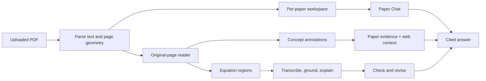

# Deep Paper Reader

Deep Paper Reader is a local-first workspace for reading machine-learning papers. It keeps the
original PDF intact, adds clickable annotations over the page, and brings in an agent only when a
concept, equation, or question needs more work.

The paper stays in view. Explanations open around it instead of replacing it with another generated
summary.

## What you can do

Upload a PDF and read it in its original layout. The reader marks methods, research concepts,
results, and equations directly on the rendered page. Clicking a term opens its meaning in the
paper, a broader explanation, supporting passages, and related research. Clicking an equation opens
a notation-aware walkthrough with symbol definitions, dimensions, implementation intuition, and an
independent quality check.

The annotation pipeline is phrase-first. It combines the Papers with Code methods archive with
names, acronyms, and technical phrases found in the paper itself, so a phrase such as `large
unsupervised language models` is treated as one idea rather than a highlight on the word `model`.
References, appendices, page furniture, and identifiers such as arXiv footers are kept out of the
automatic term set. If something useful is missed, select it in the PDF and remember it; that
correction becomes local cross-paper memory.

Paper Chat answers questions with page-level citations and routes work to the relevant specialist:
math, experiments, implementation, concepts, or research lineage. Web search is optional and runs
only for a web-enabled question or when a concept is opened for enrichment.

## How it fits together



The parser and coordinate overlays are deterministic. Model calls are reserved for synthesis,
explanation, and evaluation. Paper evidence, web context, and model inference remain separately
labeled throughout the application.

## Quick start

You need Python 3.11 or newer, [Ollama](https://ollama.com/download), and Git. Ollama should be
running before setup so the hardware check can inspect it.

### Windows PowerShell

```powershell
git clone https://github.com/Siris2314/deep-paper-reader.git
cd deep-paper-reader
.\scripts\setup.ps1
.\scripts\run_paper_reader_ui.ps1
```

### macOS or Linux

```bash
git clone https://github.com/Siris2314/deep-paper-reader.git
cd deep-paper-reader
./scripts/setup.sh
./scripts/run_paper_reader_ui.sh
```

Open [http://localhost:8503](http://localhost:8503), upload a PDF, and leave the page open while its
workspace is built. The launch scripts call the project virtual environment directly, so activating
`.venv` is optional.

Setup detects available memory, writes a conservative local profile, and prints the exact
`ollama pull` commands needed for that machine. The usual model set is:

```bash
ollama pull qwen3.5:4b
ollama pull qwen2.5:7b
ollama pull qwen2.5:3b
```

| Model | Job |
|---|---|
| `qwen3.5:4b` | Equation reading and math explanations |
| `qwen2.5:7b` | Concept synthesis, Paper Chat, and independent judging |
| `qwen2.5:3b` | Fallback for tighter hardware profiles |

For model profiles, manual hardware settings, Linux Ollama services, and troubleshooting, see
[Setup and configuration](docs/SETUP.md).

## Optional services

Setup copies [`.env.example`](.env.example) to `.env`. Parsing, PDF rendering, paper-local
annotations, and Ollama inference do not require an API key.

| Variable | What it enables | Key or documentation |
|---|---|---|
| `TAVILY_API_KEY` | On-demand concept research and web-enabled chat | [Tavily](https://app.tavily.com/home) |
| `SEMANTIC_SCHOLAR_API_KEY` | Canonical metadata for citation relationships found in the paper | [Semantic Scholar API](https://www.semanticscholar.org/product/api) |
| `OPENAI_API_KEY` | OpenAI as an alternative model backend | [OpenAI API keys](https://platform.openai.com/api-keys) |
| `LANGFUSE_PUBLIC_KEY` and `LANGFUSE_SECRET_KEY` | Traces, evaluation scores, sessions, and feedback | [Langfuse](https://cloud.langfuse.com) |

Tavily is lazy: opening a concept starts its general research explanation, while the local paper
agent handles why that concept matters here. Results are cached per paper. Ordinary PDF reading does
not call Tavily.

To install Langfuse support, include the observability extra during setup:

```powershell
.\scripts\setup.ps1 -Observability
```

```bash
./scripts/setup.sh --observability
```

Langfuse content capture is off by default. Traces contain hashes, sizes, timing, model names,
errors, and evaluation scores unless `LANGFUSE_CAPTURE_CONTENT=true` is set explicitly.

## Reading workflow

1. Upload a PDF from the sidebar and follow the parsing status.
2. Click an annotated term to inspect its paper meaning, sources, and paper-specific relevance.
3. Click an equation to open the math walkthrough and its quality check.
4. Correct a math judgment when its rubric is wrong; remembered feedback is retrieved by future
   evaluations without replacing paper evidence.
5. Ask Paper Chat in `Fast`, `Deep`, `Web`, or `Explore` mode. Citations return to the source page.
6. Select and remember a missed term to improve annotation on later papers.

`Fast` routes to one specialist. `Deep` and `Explore` can use a bounded group of specialists before
synthesis. `Web` adds external context. The coordinator owns retrieval, budgets, citations, and the
final response; specialists do not hand work to one another indefinitely.

Research-lineage labels are deliberately conservative. `Extends`, `modifies`, and `adopts` require
support in the citing sentence. A bibliography entry or citation edge by itself is treated as
background, not proof that one method inherits another.

## Math explanations

The math path is a bounded evaluation loop:

```text
PDF geometry and equation crop
  -> deterministic LaTeX and SymPy analysis
  -> nearby symbol definitions and paper evidence
  -> math explanation
  -> deterministic formatting checks
  -> independent LLM judge
  -> targeted revision when the score can improve
```

The judge scores correctness, grounding, symbol coverage, LaTeX fidelity, and usefulness. A repair
can rewrite the explanation, but it cannot change the recovered equation or invent replacement
paper evidence. Each attempt, verdict, stopping reason, and accepted revision is saved in the paper
workspace and can be traced through Langfuse when observability is enabled.

## Context and hardware diagnostics

The reader reports the estimated prompt, retrieved evidence, output reservation, configured context
limit, and Ollama model capacity for local calls. It can also show currently loaded models and their
reported VRAM use. The hardware command is available separately:

```powershell
.\.venv\Scripts\python.exe -m paper_agent.cli hardware
```

```bash
.venv/bin/python -m paper_agent.cli hardware
```

Project-level model and context settings can be applied automatically. System-wide Ollama settings
remain explicit and reversible; see [the setup guide](docs/SETUP.md#3-install-local-models).

## Quality gate

With Langfuse configured, the release gate checks parser success, math quality, chat grounding,
concept enrichment, and report scores against [the committed thresholds](llmops/gate.json):

```bash
python -m paper_agent.cli llmops-gate
```

Use `--allow-insufficient-data` while collecting an initial trace set. The command writes its
diagnosis to `llmops/reports/latest.json`. A manually triggered GitHub Actions workflow runs the same
gate for a named release; it does not promote models or prompts automatically.

## Project layout

```text
src/paper_agent/    parser, agents, memory, evaluation, and orchestration
ui/                 local original-page reader
skills/             task-specific instructions loaded only when needed
tests/              unit and workflow coverage
scripts/            setup, launch, hardware, and benchmark commands
docs/               setup and implementation notes
llmops/             quality thresholds and generated gate reports
paper_reports/      ignored per-paper workspaces
agent_memory/       ignored cross-paper corrections and local profiles
uploaded_papers/    ignored local PDF copies
```

The runtime boundaries and evidence flow are described in [ARCHITECTURE.md](ARCHITECTURE.md).

## Development

Install the development tools:

```powershell
.\scripts\setup.ps1 -Dev
```

```bash
./scripts/setup.sh --dev
```

Run the checks with the virtual environment active, or replace `python` with the direct `.venv`
executable for the platform:

```bash
python -m ruff check src ui scripts tests
python -m ruff format --check src ui scripts tests
python -m pytest -q
python -m build
```

Read [CONTRIBUTING.md](CONTRIBUTING.md) before changing prompts, skills, memory, evidence contracts,
or the UI. User-visible behavior, setup commands, models, external services, and environment
variables should be reflected in this README in the same change.

## Privacy and security

Uploaded PDFs, generated workspaces, and remembered corrections stay in ignored local directories.
When Ollama is used, model inference remains local. Only evidence sent to an explicitly enabled
external service leaves the machine.

PDFs and model output are untrusted input. Do not put secrets in prompts, generated workspaces,
screenshots, or bug reports. [SECURITY.md](SECURITY.md) documents the trust boundaries and reporting
process.

## License

[MIT](LICENSE)
