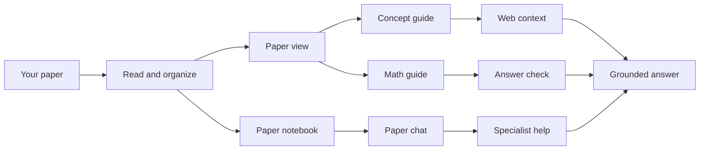

# Deep Paper Reader

Deep Paper Reader helps you work through machine-learning papers without losing the paper itself. It keeps the original PDF on screen, marks important ideas and equations, and gives you focused explanations when you click or ask a question.

> **Status:** Early alpha. The main reading, chat, memory, and evaluation features work, but explanation quality still depends on the local model and the quality of the PDF.

## What it does

- Reads the original PDF instead of rebuilding it as plain text.
- Marks methods, concepts, results, and equations directly on the page.
- Opens a clear concept explanation when you click a highlighted term.
- Walks through equations symbol by symbol and shows how they fit the paper.
- Lets you ask follow-up questions about the paper, its experiments, and its implementation.
- Shows what came from the paper, what came from the web, and what the model inferred.
- Connects ideas to earlier research when the paper actually supports that connection.
- Adjusts local Ollama settings to fit the available hardware.

## Architecture



Behind the scenes, the reader brings in only the parts of the paper and the specialist skills needed for the current question. Generated notes and remembered corrections stay local and outside source control.

## Quickstart

### Prerequisites

- Python 3.11 or newer
- [Ollama](https://ollama.com/download)
- Git

Clone or download the repository, then run the platform setup script:

**Windows PowerShell**

```powershell
git clone https://github.com/Siris2314/deep-paper-reader.git
cd deep-paper-reader
.\scripts\setup.ps1
.\scripts\run_paper_reader_ui.ps1
```

**macOS or Linux**

```bash
git clone https://github.com/Siris2314/deep-paper-reader.git
cd deep-paper-reader
./scripts/setup.sh
./scripts/run_paper_reader_ui.sh
```

Open [http://localhost:8503](http://localhost:8503), upload a PDF, and wait for the local parser to build the paper workspace. The scripts use `.venv` directly, so shell activation is optional.

The hardware check reports the exact `ollama pull` commands required for the selected profile. The default model set is:

```bash
ollama pull qwen3.5:4b
ollama pull qwen2.5:7b
ollama pull qwen2.5:3b
```

`qwen3.5:4b` handles paper math. `qwen2.5:7b` handles concept synthesis, chat, and independent judging. The 3B model is a fallback for constrained hardware.

## Configuration

Setup creates `.env` from [`.env.example`](.env.example). Local parsing and deterministic highlighting require no API key.

| Variable | Required | Purpose | Get a key |
|---|---|---|---|
| `TAVILY_API_KEY` | No | On-demand concept research and web chat | [Tavily](https://app.tavily.com/home) |
| `SEMANTIC_SCHOLAR_API_KEY` | No | Canonical metadata for locally found citation relationships | [Semantic Scholar API](https://www.semanticscholar.org/product/api) |
| `OPENAI_API_KEY` | No | Optional OpenAI model backend | [OpenAI API keys](https://platform.openai.com/api-keys) |
| `LANGSMITH_API_KEY` | No | Optional LangGraph/LangChain tracing | [LangSmith settings](https://smith.langchain.com/settings) |

Tavily is lazy: it is called when a user opens a highlighted concept or selects a web-enabled chat mode. Uploaded PDFs, parsed pages, model prompts, and local memory stay on the machine when Ollama is used, except for the exact evidence sent to explicitly enabled external services.

See [Setup and configuration](docs/SETUP.md) for model profiles, platform-specific steps, environment variables, verification, and troubleshooting.

## Using the reader

1. Upload a paper in the left sidebar.
2. Click a highlighted concept for paper evidence, external background, and paper-specific synthesis.
3. Click an equation region for a grounded math walkthrough and judge evaluation.
4. Use **Paper Chat** in `Fast`, `Deep`, `Web`, or `Explore` mode.
5. Select a missed term in the PDF and choose **Remember** to teach the highlighter.

Paper-chat citations jump to the original page. Strong lineage labels such as `extends`, `modifies`, and `adopts` require explicit support in the current paper; a citation edge alone is treated as background.

## Project structure

```text
src/paper_agent/    core Python code
ui/                 local paper reader
skills/             focused instructions for specialist tasks
tests/              automated tests
scripts/            setup, launch, hardware, and benchmark tools
docs/               setup and project guides
paper_reports/      local notes and analysis for each paper (ignored)
agent_memory/       remembered user corrections (ignored)
uploaded_papers/    local PDF copies (ignored)
```

Runtime boundaries and evidence flow are documented in [ARCHITECTURE.md](ARCHITECTURE.md).

## Development

Install development tools:

```powershell
.\scripts\setup.ps1 -Dev
```

```bash
./scripts/setup.sh --dev
```

Activate `.venv` (or invoke its Python executable directly), then run the release checks:

```bash
python -m ruff check src ui scripts tests
python -m ruff format --check src ui scripts tests
python -m pytest -q
python -m build
```

See [CONTRIBUTING.md](CONTRIBUTING.md) before changing prompts, skills, memory, or evidence contracts.

## Security and privacy

PDFs and model output are untrusted input. Do not put secrets in prompts, generated workspaces, screenshots, or bug reports. Review [SECURITY.md](SECURITY.md) for the trust model, external-service boundaries, and vulnerability reporting.

## License

[MIT](LICENSE)
